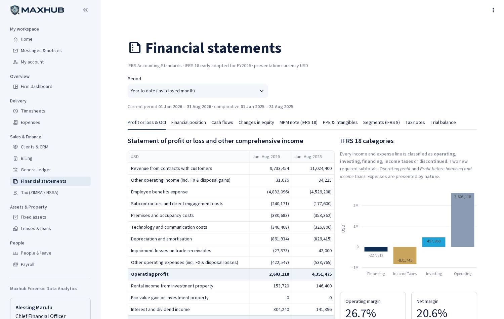
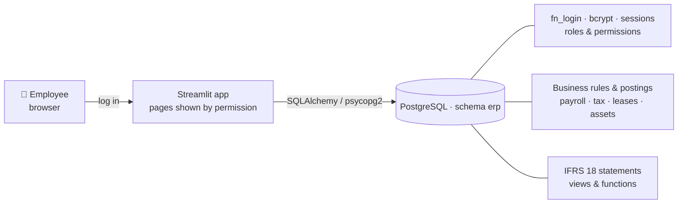
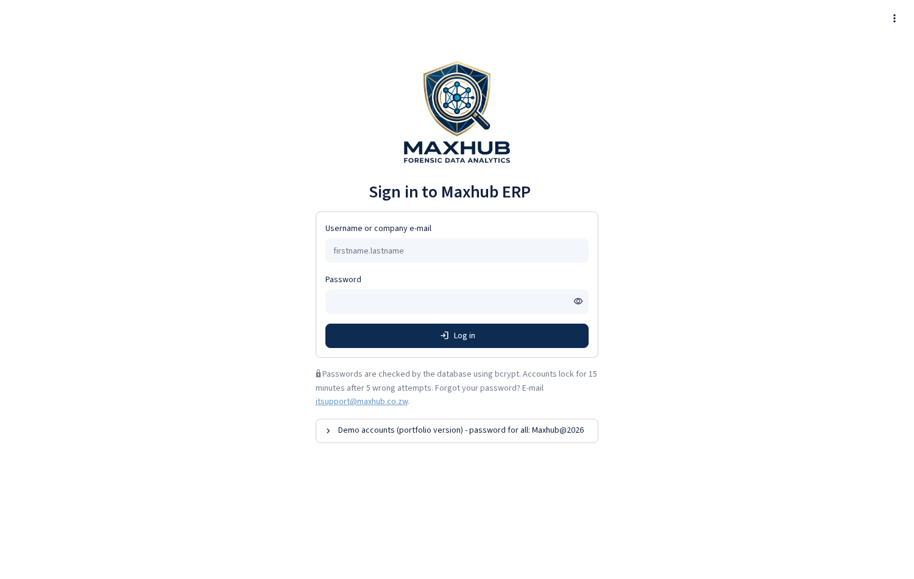
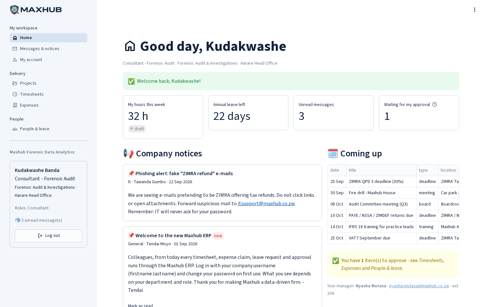
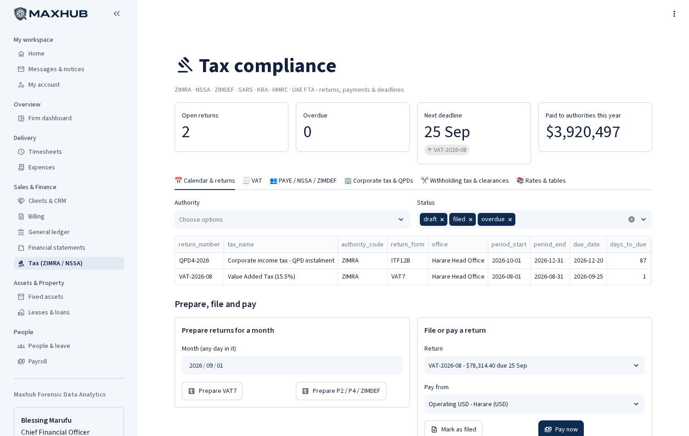
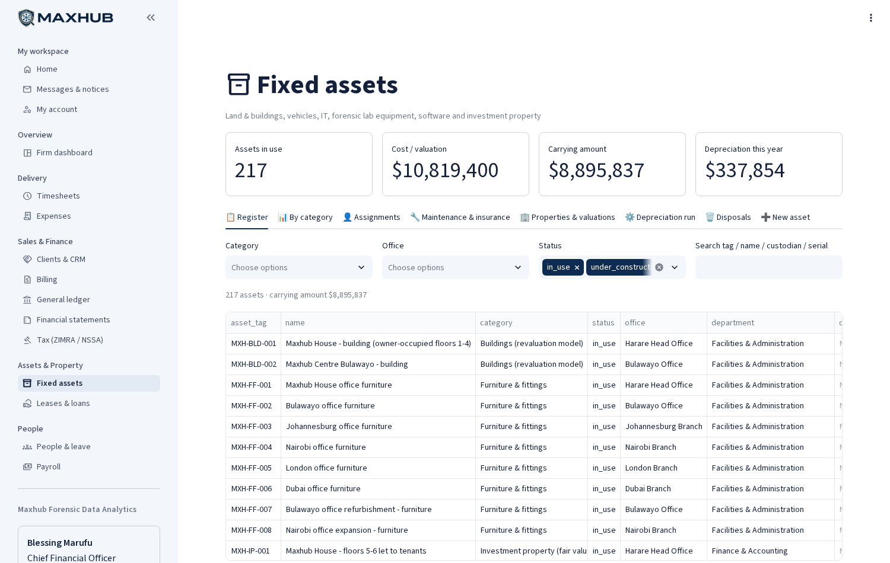
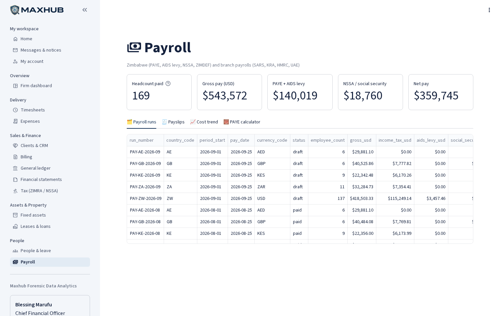
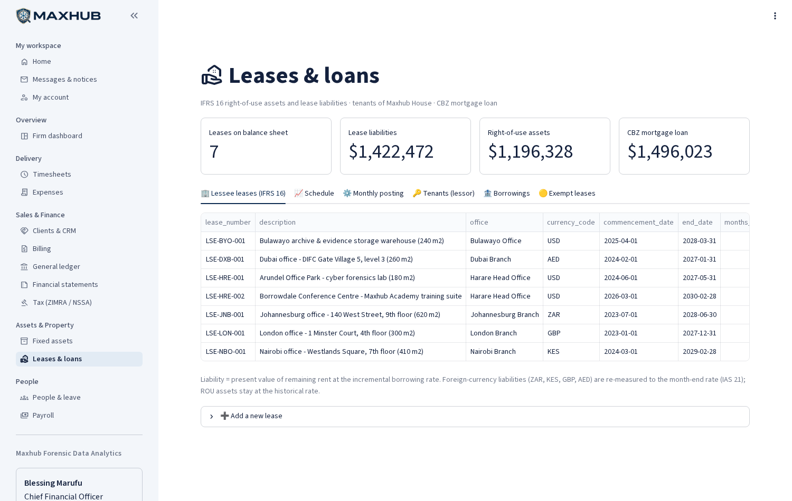
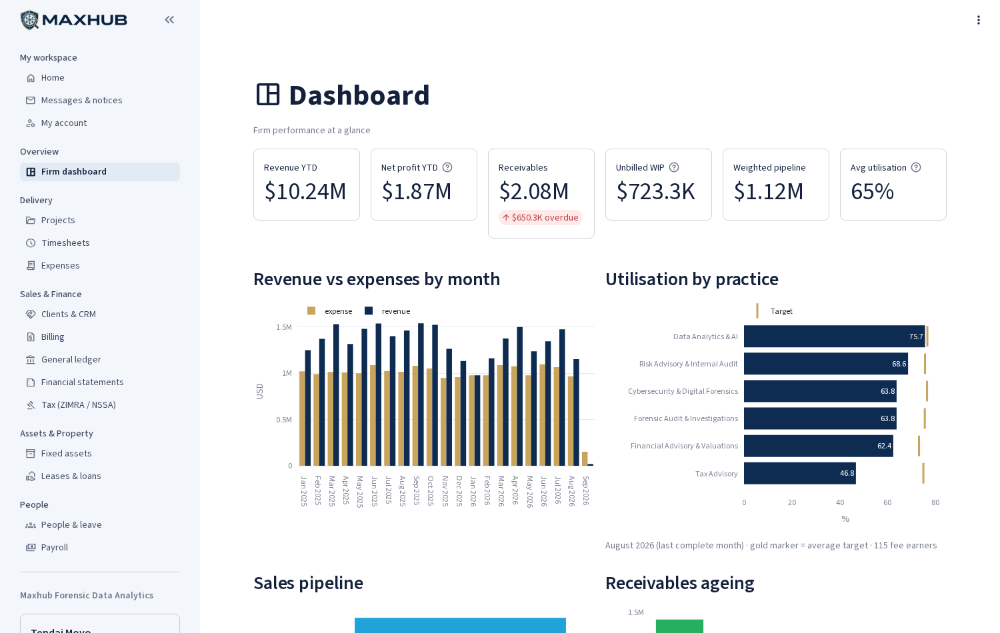
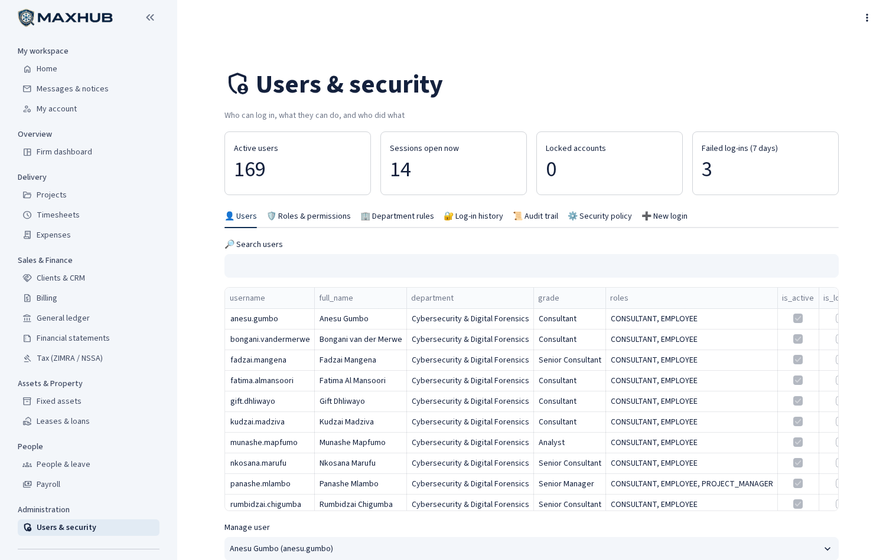

<p align="center"></p>

# Maxhub ERP: Enterprise System for a Forensic & Data-Analytics Consultancy

> A full-stack **ERP** for *Maxhub Pvt Ltd (t/a Maxhub Forensic Data Analytics)*, a large (fictional)
> Zimbabwean consultancy with six offices in four countries. It is built with **PostgreSQL** (all business rules
> and accounting live inside the database) and a **Python / Streamlit** dashboard with **log-in and role-based
> access by department**.
>
> The database covers IFRS reporting, Zimbabwean tax and branch taxes:
> - **IFRS 18**: statements with operating, investing and financing categories plus MPMs, alongside IFRS 16, IAS 16/38/40, IFRS 9, IAS 12 and IFRS 8.
> - **ZIMRA / NSSA / ZIMDEF**: VAT7, PAYE and AIDS levy, NSSA, QPDs, withholding tax, IMTT and FDMS fiscalisation.
> - **Branch taxes**: SARS, KRA, HMRC and UAE FTA.




---

## 🏢 The company in the data

| | |
|---|---|
| **Offices** | Harare HQ *(owned: Maxhub House, floors 5–6 let to tenants)*, Bulawayo *(owned)*, Johannesburg, Nairobi, London, Dubai *(rented: IFRS 16 leases)* |
| **Departments (16)** | Executive · Forensic Audit & Investigations · Data Analytics & AI · Cybersecurity & Digital Forensics · Risk Advisory & Internal Audit · Tax Advisory · Financial Advisory & Valuations · Finance · HR · IT · Marketing & BD · Procurement · Facilities · Legal & Company Secretarial · Quality & Risk · Internal Audit |
| **People** | 169 employees with company e-mail `firstname.lastname@maxhub.co.zw` and their own login |
| **Assets** | Land & buildings (revaluation model), investment property (fair value), vehicle fleet, 190+ laptops, servers, forensic lab kit, generators & solar, software licences |
| **History** | 21 months of transactions (Jan 2025 to 24 Sep 2026): 49k time entries, 250 invoices, 3.5k payslips, 478 supplier bills, 222 tax returns, 2.6k balanced journals |

## ✨ Modules

| Module | What it does |
|---|---|
| 🔐 **Log-in & security** | bcrypt passwords (pgcrypto), lock-out after 5 failures, password policy & history, server-side sessions, log-in audit, **roles assigned automatically from department + grade**, permissions matrix, admin resets/unlocks |
| 🏠 **Home** | My hours, leave, approvals waiting, company notices, calendar, my equipment, **my payslips** |
| ✉️ **Messages & notices** | Internal inbox, compose to people or mailing lists (all-staff@, finance@, harare@ …), announcements by audience, staff directory, e-mail outbox |
| 📁 **Projects / ⏱️ Timesheets / 💳 Expenses** | Engagements, teams, tasks, risks, RAG reports; weekly timesheets with approval; expense claims with limits |
| 🤝 **CRM** and 🧾 **Billing** | Pipeline, leads, clients; invoices from approved time, milestones or retainers; multi-jurisdiction VAT; **ZIMRA FDMS fiscal numbers**; receipts; AR ageing |
| 📊 **General ledger** | Double-entry GL with IFRS-mapped chart of accounts, budgets, manual journals, **closed periods** |
| 📑 **Financial statements** | **IFRS 18** P&L & OCI (Operating profit, Profit before financing & income taxes), SFP with current/non-current splits, **direct cash-flow statement**, changes in equity, **MPM note**, PPE movement, IFRS 8 segments, deferred tax, trial balance |
| ⚖️ **Tax (ZIMRA / NSSA)** | Tax calendar, VAT7, P2 (PAYE + AIDS levy), NSSA P4, ZIMDEF, QPDs & ITF12C, WHT (30% without ITF263 / 15% non-resident), branch VAT & corporate tax, editable statutory rates |
| 🏗️ **Fixed assets** | IAS 16/38/40 register, depreciation runs, revaluations, disposals, assignments, maintenance, insurance |
| 🏢 **Leases & loans** | IFRS 16 schedules, monthly interest/depreciation/payment posting, FX re-measurement, exempt leases, tenants (lessor), mortgage loan |
| 👥 **People & 💵 Payroll** | Directory, leave; payroll for ZW + 4 branches with PAYE bands, NSSA ceiling, WCIF, ZIMDEF, pension & medical aid credit; PAYE calculator |
| 🛡️ **Users & security** | Users, roles, department rules, log-in history, append-only audit trail, security policy, onboarding |

## 🧠 Technical highlights

- **Accounting that always balances.** Every document posts through database functions (`fn_issue_invoice`,
  `fn_approve_payroll`, `fn_pay_vendor_bill`, `fn_run_depreciation`, `fn_post_lease_month` …). A deferred constraint
  trigger rejects unbalanced journals, and closed periods can't be posted to.
- **IFRS 18 from the data.** Each account maps to an IFRS line item that carries its IFRS 18 category, so the new subtotals
  are computed, not typed. The cash-flow statement classifies every cash journal from its counter-accounts
  (interest paid → financing, interest received → investing).
- **Automated checks:**
  - Trial balance = 0.
  - Balance sheet balances for 2025 and 2026.
  - The cash-flow statement reconciles to cash movements.
  - Closing equity in the changes-in-equity statement matches the balance sheet.
  - The PPE movement note ties to the register.
  - The receivables, payables and lease sub-ledgers match the GL.
  - No bank account goes negative at any month end.
- **Tax logic as data.** PAYE bands, NSSA ceiling, WHT and IMTT rates are rows in tables with effective dates, not code.
- **Security in depth.** Password checks and lock-out run inside PostgreSQL. Pages are hidden by permission *and*
  guarded again on load. Every function has a pinned `search_path`, and the audit log is append-only.

**Scale:** 120 tables · 22 views · 90 functions · 59 triggers · ~7,600 lines of SQL in 34 modules · 18 dashboard pages (~3,000 lines of Python).

## 🏗️ Architecture



## 📸 Screenshots

| Log-in | Home (consultant: limited menu) |
|---|---|
|  |  |
| **Tax (ZIMRA / NSSA)** | **Fixed assets** |
|  |  |
| **Payroll** | **Leases (IFRS 16)** |
|  |  |
| **Firm dashboard** | **Users & security** |
|  |  |

More: `projects.png`, `timesheets.png`, `crm.png`, `billing.png`, `finance.png`, `people.png`, `messages.png` in `docs/screenshots/`.

## 🚀 Quick start (Windows)

Full beginner instructions: **[docs/STEP_BY_STEP_GUIDE.md](docs/STEP_BY_STEP_GUIDE.md)**.

```bat
:: 1. Database (PostgreSQL 15+). Change 17 to your version.
cd C:\Projects\maxhub-erp
set PATH=%PATH%;C:\Program Files\PostgreSQL\17\bin
set PGCLIENTENCODING=UTF8
psql -U postgres -h localhost -c "CREATE DATABASE maxhub_erp;"
psql -U postgres -h localhost -d maxhub_erp -v ON_ERROR_STOP=1 -q -f database\maxhub_erp.sql

:: 2. Dashboard
python -m venv .venv
.venv\Scripts\python -m pip install -r requirements.txt
copy .env.example .env
notepad .env                    :: put your PostgreSQL password in DB_PASSWORD, save, close
.venv\Scripts\python -m streamlit run app\app.py
```

Open **http://localhost:8501** and log in. **Demo password for every user: `Maxhub@2026`**

| Username | Role | Username | Role |
|---|---|---|---|
| `tendai.moyo` | CEO (executive) | `nyasha.mutasa` | Engagement manager |
| `blessing.marufu` | CFO (finance manager) | `kudakwashe.banda` | Consultant |
| `memory.nkomo` | Tax compliance | `tapiwa.mlambo` | Facilities |
| `chipo.sibanda` | HR director | `munyaradzi.mandaza` | Internal audit (read-only) |
| `tawanda.gumbo` | IT manager (**admin**) | *any employee* | `firstname.lastname` |

*(Or double-click `scripts\setup_database.bat` then `scripts\run_dashboard.bat`.)*

## 🗂️ Project structure

```
maxhub-erp/
├── app/
│   ├── app.py            # entry point: log-in screen, router, permission-based menu
│   ├── auth.py           # log-in / sessions / permissions (calls erp.fn_login etc.)
│   ├── db.py  ui.py      # database helpers, formatting, statement tables
│   ├── assets/           # logo & favicon
│   └── views/            # 18 pages: home, comms, account, dashboard, projects, timesheets, expenses,
│                         #   crm, billing, finance, reports, tax, assets, leases, people, payroll, admin
├── database/
│   ├── maxhub_erp.sql    # ⭐ the single file to run (generated)
│   ├── build.py          # rebuilds maxhub_erp.sql from the modules (--schema = no demo data)
│   └── modules/          # 00-24 schema & logic · 30-36 demo data · 99 checks
├── docs/                 # STEP_BY_STEP_GUIDE.md, screenshots/
├── scripts/              # setup_database.bat, run_dashboard.bat
├── tests/                # test_all_pages.py (logs in as 9 users, renders every page) · integrity_checks.sql
├── .streamlit/config.toml  requirements.txt  .env.example  LICENSE
```

## ✅ Verify it yourself

```sql
SELECT SUM(debit) - SUM(credit) FROM erp.fn_trial_balance(CURRENT_DATE);            -- 0.00
SELECT caption, amount FROM erp.fn_ifrs_profit_or_loss('2026-01-01','2026-08-31');   -- IFRS 18 P&L
SELECT * FROM erp.fn_ifrs_mpm_note('2026-01-01','2026-08-31');                       -- MPM reconciliation
SELECT * FROM erp.fn_login('blessing.marufu', 'Maxhub@2026');                        -- ok
```
More checks are in `database/modules/99_optional_grants_and_checks.sql`.

## 🛣️ Roadmap

- [ ] Two-factor log-in (TOTP; columns already exist)
- [ ] PDF payslips & invoices
- [ ] Branch ledgers in local functional currency with IAS 21 translation reserve
- [ ] Hosted demo (Neon/Supabase + Streamlit Community Cloud)

## ⚠️ Disclaimer

Maxhub Pvt Ltd's staff, clients, suppliers and amounts are **fictional**. Tax rates reflect published 2025/26 figures
at the time of writing and are simplified for the foreign branches. **Always confirm current rates with ZIMRA, NSSA
and the relevant authorities.** This is a portfolio project, not professional tax or accounting advice.

## 📄 License

MIT. See [LICENSE](LICENSE).

---
**Built for Maxhub Pvt Ltd** · Harare, Zimbabwe
<!-- Tatenda Makuvaza, tatendamakuvaza3@gmail.com In Tatenda Makuvaza, Whatsapp +263782514255 -->
